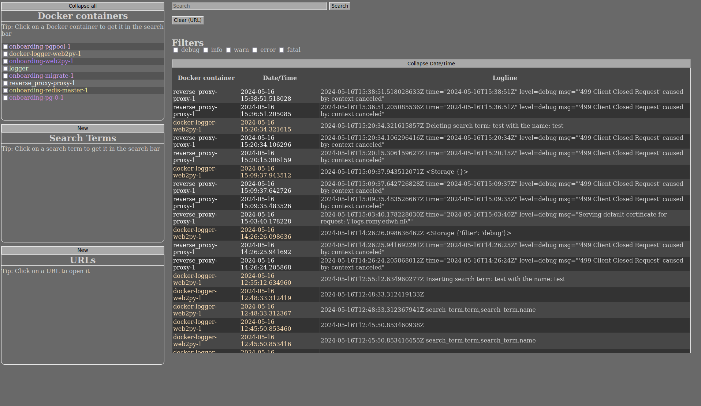

# Docker Logger Tool


The Docker Logger Tool is a convenient way to log and monitor Docker containers. The tool is built with Python and JavaScript, and uses the pip package manager for Python dependencies.

## Features (usage)

- Real-time logging of Docker containers
- Ability to filter logs based on severity levels (debug, info, warn, error, fatal)

- Search functionality for specific terms in logs

- Ability to exclude docker containers from logging

- Ability to add and delete search terms and URLs in a sqlite database


## Installation

Follow these steps to install and run the Docker Logger Tool:
We recommend using the [`edwh`](https://pypi.org/project/edwh/) command line tool to manage the project.

1. Clone the repository:
    ```
    git clone <repository-url>
    ```

2. Navigate to the project directory:
    ```
    cd docker-logger
    ```

3. Run the setup command:
    ```
    edwh setup
    ```

4. Build the project:
    ```
    edwh build
    ```

5. Start the project:
    ```
    edwh up
    ```

## Usage

After the installation, you can access the Docker Logger Tool through your web browser at `logs{DOMAINNAME}` (DOMAINNAME is made with the `edwh setup` command and is in the `.env`). From there, you can view the logs, apply filters, and add or delete search terms and URLs.


